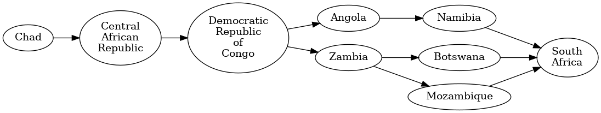

# Travle Earth Graph Generator

This Python script generates a graph visualization of connections between countries based on a dataset provided in CSV format. The project is inspired by the online geography game [travle.earth](https://travle.earth/).

## Overview

The script reads a CSV file containing country connections, parses the data, and performs a breadth-first search (BFS) algorithm to find the shortest path between two specified countries. It then generates a graph in DOT format, which can be converted into PNG or SVG images using Graphviz.

## Usage

To use the script, follow these steps:

1. **Clone the Repository:** Clone this repository to your local machine.

   ```bash
   git clone https://github.com/AurelienPasquet/travle.git
   ```

2. **Navigate to the Directory:** Move into the project directory.

   ```bash
   cd travle
   ```

3. **Install Dependencies:** Ensure you have Python 3 installed on your system. Additionally, install Pydot to generate graph images.

   ```bash
   pip install pydot
   ```
   To view graph images, install Graphviz on your system:
   - Linux:
   ```bash
   sudo apt install graphviz
   ```
   - MacOS:
   ```bash
   sudo port install graphviz
   ```
   - Windows: Download installer [here](https://graphviz.org/download/#windows).

## Run the program

Please note that countries with spaces in their names must be written between double quotation marks or by replacing spaces by undercores, example [below](#search-mode-example). Country names are case sensitive. All words, except for prepositions, start with a capital letter.

There are two ways to execute the program:

   1. **Game mode**

   Find the shortest path from country A to country B. You are only allowed 3 mistakes, guess carefully!
   
   ```bash
   python travle.py game
   ```

   2. **Search mode**

   Creates a graph showing all paths from the source country to the target country.

   ```bash
   python travel.py search <source> <target> [paths number]
   ```

   - `<source>`: The source country.
   - `<target>`: The target country.
   - `[paths number]`: Optional parameter to specify the number of paths to print. Defaults to the number of paths found by the program.

## Search Mode Example

To find and visualize the 3 first shortest paths from Chad to South Africa:

```bash
python travle.py Chad South_Africa 3
```

or

```bash
python travle.py Chad "South Africa" 3
```



## Dataset

The script uses a dataset provided in CSV format. Each line in the CSV file represents a country and its neighboring countries, separated by commas.

## Credits

This project is inspired by the online geography game [travle.earth](https://travle.earth/).
